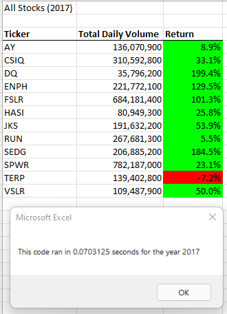

# Module 2 Challenge: Refactoring VBA Code

## Overview of Project

The purpose of this analysis was to determine whether refactoring VBA code can improve the efficiency of VBA code. In this particular instance, the goal was to reduce the time required to calculate the performance of 12 sample stocks for the years 2017 and 2018. Execution times for the original VBA script (initially created as part of an introduction to VBA coding) and the refactored VBA script were compared.

## Results
Refactoring significantly reduced the execution times to calculate the performance of 12 sample stocks for both the years 2017 and 2018. For 2017, execution times were reduced from 0.63 seconds to 0.07 seconds (89% reduction). For 2018, execution times were similarly reduced, from 0.64 seconds to 0.07 seconds (89% reduction). For both 2017 and 2018, calculated total daily volume and returns were identical for both the original VBA script and the refactored VBA script. For original and refactored code, see **Appendix** below.


**Figure 1: 2017 Stocks Analysis: Original VBA Script**


**Figure 2: 2017 Stocks Analysis: Refactored VBA Script**




**Figure 3: 2018 Stocks Analysis: Original VBA Script**


**Figure 4: 2018 Stocks Analysis: Refactored VBA Script**


## Summary
Refactoring the VBA code reduced execution times while providing the same results. 

### What are the advantages or disadvantages of refactoring code?
The advantage of refactoring code is that there is the potential to make the code run more efficiently. For small datasets, the increase in efficiency may not be noticeable, but for large datasets, improving efficiency of the code can greatly reduce the amount of time required to execute the code. Depending on your computer's hardware configuration, it is possible that refactoring may make the difference between running out of memory or not running out of memory when analyzing large sets of data. 

The disadvantage of refactoring code is that it is possible that you may actually slow the execution time.  Readability of the code may also become more difficult.  In addition, it's quite possible that the original programmer wrote the code specifically to handle unique challenges in their data, and refactoring the code may introduce unintended problems that may not readily become apparent. There is also the disadvantage of time required to refactor the code.  If it's not broke, don't fix it. 

### How do the pros and cons apply to refactoring the original VBA script?
By refactoring the original VBA script, I was able to reduce the execution times significantly, which was the main advantage I was trying to achieve. The process was not without its challenges. As I was refactoring, I reached a point where I was only getting the appropriate result for the first stock, and all subsequent stocks had a total daily volume of zero and an error for the return.  Through a series of troubleshooting steps and temporary message boxes, I was able to determine that I had a typo in a variable name at one referenced location ("tickersIndex" rather than "tickerIndex"). Once found and corrected, the script ran fine. 

Another challenge that I encountered with refactoring was with readability. While the nested loops used in the original script made it easier to visualize how the code was running, the refactored code was more difficult for me to understand. In particular, the purpose of incrementing the tickerIndex after each loop was not immediately evident to me. Once I understood how the refactored code worked, it made sense why the refactored code would run faster than original (required one single loop to pass through all stocks rather than requiring a series of inner loops for each pass of the outer loop)

## Appendix

**Original VBA Script**
```

Sub AllStocksAnalysis()
    
    'Timer
    Dim startTime As Single
    Dim endTime As Single
        
    'Activate worksheet
    Worksheets("All Stocks Analysis").Activate

    'Input year
    yearvalue = InputBox("What year would you like to run this analysis on?")

    'Start Timer
    startTime = Timer

    Range("A1").Value = "All Stocks (" + yearvalue + ")"

    'Create Headers
    Cells(3, 1).Value = "Ticker"
    Cells(3, 2).Value = "Total Daily Volume"
    Cells(3, 3).Value = "StartingPrice"
    Cells(3, 4).Value = "EndingPrice"
    Cells(3, 5).Value = "Return"
    
    'Create array
    Dim tickers(12) As String
    
    'Assign Tickers
    tickers(0) = "AY"
    tickers(1) = "CSIQ"
    tickers(2) = "DQ"
    tickers(3) = "ENPH"
    tickers(4) = "FSLR"
    tickers(5) = "HASI"
    tickers(6) = "JKS"
    tickers(7) = "RUN"
    tickers(8) = "SEDG"
    tickers(9) = "SPWR"
    tickers(10) = "TERP"
    tickers(11) = "VSLR"

    'Initial variables for starting and ending price
    Dim startingPrice As Single
    Dim endingPrice As Single
    
    'Activate data worksheet
    Worksheets(yearvalue).Activate
        
    'Find number of rows
    'rowEnd code taken from https://stackoverflow.com/questions/18088729/row-count-where-data-exists
    rowstart = 2
    RowEnd = Cells(Rows.Count, "A").End(xlUp).Row
    TotalVolume = 0
    
    'Loop through tickers
    For i = 0 To 11
        ticker = tickers(i)
        TotalVolume = 0
        
        'Loop through rows
        Worksheets(yearvalue).Activate
        For j = rowstart To RowEnd
        
        'Find volume for the ticker
         If Cells(j, 1).Value = ticker Then
            TotalVolume = TotalVolume + Cells(j, 8).Value
        End If
        
        'Find Starting Price
        If Cells(j - 1, 1) <> ticker And Cells(j, 1) = ticker Then
            startingPrice = Cells(j, 6).Value
        End If
                
        'Find Ending Price
        If Cells(j + 1, 1) <> ticker And Cells(j, 1) = ticker Then
            endingPrice = Cells(j, 6).Value
        End If
     
        Next j
        
    'Output results
    Worksheets("All Stocks Analysis").Activate
    Cells(4 + i, 1).Value = ticker
    Cells(4 + i, 2).Value = TotalVolume
    Cells(4 + i, 3).Value = startingPrice
    Cells(4 + i, 4).Value = endingPrice
    Cells(4 + i, 5).Value = endingPrice / startingPrice - 1
    
    Next i
    
    'Formatting
        Worksheets("All Stocks ANalysis").Activate
    
    'Bold the headers
    Range("A3:E3").Font.Bold = True
    Range("A3:E3").Borders(xlEdgeBottom).LineStyle = xlContinuous
    
    'Number formats
    Range("B4:B15").NumberFormat = "#,##0"
    Range("C4:D15").NumberFormat = "$#,##0.00"
    Range("E4:E15").NumberFormat = "0.0%"
    Columns("B").AutoFit
    
        
    'Cell shading
    DataRowStart = 4
    DataRowEnd = 15
    
    'Loop through rows to format the color
    For i = DataRowStart To DataRowEnd
    
    If Cells(i, 5) > 0 Then
        'Make it green
        Cells(i, 5).Interior.Color = vbGreen
    ElseIf Cells(i, 5) <= 0 Then
        'Make it red
        Cells(i, 5).Interior.Color = vbRed
    Else
        'Clear color
        Cells(i, 5).inter.Color = vbNone
        
    End If
    
    Next i
     
    
    'End Time
    endTime = Timer
    MsgBox "This code rand in " & (endTime - startTime) & " seconds for the year " & (yearvalue)

End Sub

Sub formatAllStocksAnalysisTable()

    Worksheets("All Stocks ANalysis").Activate
    
    'Bold the headers
    Range("A3:E3").Font.Bold = True
    Range("A3:E3").Borders(xlEdgeBottom).LineStyle = xlContinuous
    
    'Number formats
    Range("B4:B15").NumberFormat = "#,##0"
    Range("C4:D15").NumberFormat = "$#,##0.00"
    Range("E4:E15").NumberFormat = "0.00%"
    Columns("B").AutoFit
    
        
    'Cell shading
    DataRowStart = 4
    DataRowEnd = 15
    
    'Loop through rows to format the color
    For i = DataRowStart To DataRowEnd
    
    If Cells(i, 5) > 0 Then
        'Make it green
        Cells(i, 5).Interior.Color = vbGreen
    ElseIf Cells(i, 5) <= 0 Then
        'Make it red
        Cells(i, 5).Interior.Color = vbRed
    Else
        'Clear color
        Cells(i, 5).inter.Color = vbNone
        
    End If
    
    Next i
     
  
End Sub
```

Note: formatting in the original VBA code was as separate script that was activated by a button.


**Refactored VBA Script**

```
Sub AllStocksAnalysisRefactored()
    Dim startTime As Single
    Dim endTime  As Single

    'Input box to input the year for the analysis
    yearvalue = InputBox("What year would you like to run the analysis on?")

    'Start the timer: From after inputting hte year to analyze to end of output and formatting
    startTime = Timer
    
    'Format the output sheet on All Stocks Analysis worksheet
    Worksheets("All Stocks Analysis").Activate
    
    Range("A1").Value = "All Stocks (" + yearvalue + ")"
    
    'Create a header row
    Cells(3, 1).Value = "Ticker"
    Cells(3, 2).Value = "Total Daily Volume"
    Cells(3, 3).Value = "Return"

    'Initialize array of all tickers
    Dim tickers(12) As String
    
    tickers(0) = "AY"
    tickers(1) = "CSIQ"
    tickers(2) = "DQ"
    tickers(3) = "ENPH"
    tickers(4) = "FSLR"
    tickers(5) = "HASI"
    tickers(6) = "JKS"
    tickers(7) = "RUN"
    tickers(8) = "SEDG"
    tickers(9) = "SPWR"
    tickers(10) = "TERP"
    tickers(11) = "VSLR"
    
    'Activate data worksheet with yrea specified in input box
    Worksheets(yearvalue).Activate
    
    'Get the number of rows to loop over
    RowCount = Cells(Rows.Count, "A").End(xlUp).Row
    
    '1a) Create a ticker Index and set the initial tickerIndex to 0
    Dim tickerIndex As Single
    tickerIndex = 0
    
    '1b) Create three output arrays
    Dim tickerVolumes(12) As Long
    Dim tickerStartingPrices(12) As Single
    Dim tickerEndingPrices(12) As Single
    
    
    ''2a) Create a for loop to initialize the tickerVolumes to zero.
    Worksheets(yearvalue).Activate
    For k = 0 To 11
        tickerVolumes(k) = 0
    Next k

       
    '2b) Loop over all the rows in the spreadsheet.
    'rowCount code taken from https://stackoverflow.com/questions/18088729/row-count-where-data-exists
    Worksheets(yearvalue).Activate
    'RowCount = Cells(Rows.Count, "A").End(xlUp).Row
     
    For i = 2 To RowCount

    
        '3a) Increase volume for current ticker
            If Cells(i, 1).Value = tickers(tickerIndex) Then
                 tickerVolumes(tickerIndex) = (tickerVolumes(tickerIndex) + Cells(i, 8).Value)
            End If
        
        '3b) Check if the current row is the first row with the selected tickerIndex.
      
            If Cells(i, 1).Value = tickers(tickerIndex) And Cells(i - 1, 1).Value <> tickers(tickerIndex) Then
                tickerStartingPrices(tickerIndex) = Cells(i, 6).Value
            End If
          
        '3c) check if the current row is the last row with the selected ticker
         'If the next row’s ticker doesn’t match, increase the tickerIndex.
            
            If Cells(i, 1) = tickers(tickerIndex) And Cells(i + 1, 1).Value <> tickers(tickerIndex) Then
                tickerEndingPrices(tickerIndex) = Cells(i, 6).Value
            End If
            'NOTE: increments correctly only of the data is sorted by ticker
        
        
        '3d Increase the tickerIndex if the next row ticker does not match the previous row ticker
                If Cells(i, 1) <> Cells(i + 1, 1) Then
                    tickerIndex = tickerIndex + 1
                End If
                
                
        'Troubleshooting: Check cell ticker vs array ticker vs tickerindex
          'MsgBox (Cells(i, 1) & " " & tickers(tickerIndex) & " " & tickerIndex)
         
    Next i
    
    '4) Loop through arrays to output the Ticker, Total Daily Volume, and Return.
    
    
    'Output ticker, ticker volume, and return to "All Stocks Analysis"
    For j = 0 To 11
        
        Worksheets("All Stocks Analysis").Activate
        Cells(4 + j, 1).Value = tickers(j)
        Cells(4 + j, 2).Value = tickerVolumes(j)
        Cells(4 + j, 3).Value = (tickerEndingPrices(j) / tickerStartingPrices(j)) - 1
        
    Next j
    
    'Formatting
    Worksheets("All Stocks Analysis").Activate
    Range("A3:C3").Font.FontStyle = "Bold"
    Range("A3:C3").Borders(xlEdgeBottom).LineStyle = xlContinuous
    Range("B4:B15").NumberFormat = "#,##0"
    Range("C4:C15").NumberFormat = "0.00%"
    Columns("B").AutoFit

    'Define starting and ending rows
    dataRowStart = 4
    dataRowEnd = 15

    For i = dataRowStart To dataRowEnd
        'If postitive return, shade cells green
        If Cells(i, 3) > 0 Then
            
            Cells(i, 3).Interior.Color = vbGreen
            
        Else
        'Else if not positive return, shade red
            Cells(i, 3).Interior.Color = vbRed
            
        End If
        
    Next i
 
    'End Timer and return run time
    endTime = Timer
    MsgBox "This code ran in " & (endTime - startTime) & " seconds for the year " & (yearvalue)

End Sub
```


